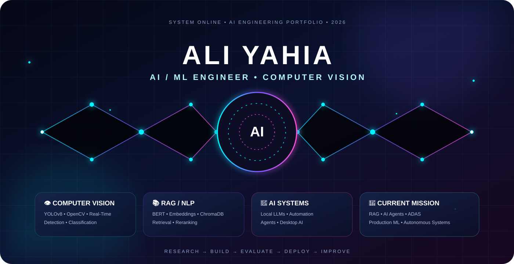

<div align="center">

<a href="https://github.com/HopeofTheUniverse">

</a>

<a href="https://github.com/HopeofTheUniverse">

</a>
<a href="https://www.linkedin.com/in/ali-yahia-804399291">

</a>
<a href="mailto:aliyahialegacy@gmail.com">

</a>

<br/><br/>


</div>


## 🧠 ABOUT ME

> **AI / ML Engineer specializing in Computer Vision**

I'm **Ali Yahia Hussein**, a Computer Science student and AI/ML engineer who enjoys turning research ideas into complete, usable intelligent applications.

My experience spans machine learning pipelines, deep learning, object detection, real-time computer vision, NLP, retrieval-augmented systems, local LLM applications, APIs, and desktop AI.

```text
┌─────────────────────────────────────────────────────────────┐
│  MINDSET                                                     │
│                                                             │
│  Research  →  Build  →  Evaluate  →  Deploy  →  Improve   │
│                                                             │
│  Goal: technically strong AI systems that are useful        │
│        outside the notebook.                                │
└─────────────────────────────────────────────────────────────┘
```

---

# ⚡ WHAT I DO

<table>
<tr>
<td width="50%">

### 👁️ COMPUTER VISION

`YOLOv8` · `OpenCV` · `FER`

- Object detection
- Image/video inference
- Real-time systems
- Classification
- Bounding-box annotation
- Severity scoring

</td>
<td width="50%">

### 🧠 MACHINE LEARNING

`scikit-learn` · `LightGBM` · `XGBoost`

- Classification
- Regression
- Clustering
- Feature engineering
- Model benchmarking
- Evaluation & error analysis

</td>
</tr>
<tr>
<td>

### 📚 NLP & RAG

`BERT` · `Sentence Transformers` · `ChromaDB`

- Dense embeddings
- Semantic retrieval
- Cross-encoder reranking
- TF-IDF baselines
- Topic discovery
- Precision@K evaluation

</td>
<td>

### 🤖 AI APPLICATIONS

`Ollama` · `Electron` · `Flask` · `Streamlit`

- Local LLMs
- AI assistants
- Speech-to-text
- REST APIs
- Automation
- Desktop AI

</td>
</tr>
</table>

---

# 🚀 FEATURED PROJECTS

## 🚗 CarDamage AI
### Vehicle Damage Detection & Severity Scoring

**Python · YOLOv8 · Ultralytics · OpenCV · Streamlit · Roboflow**

```text
IMAGE / VIDEO
      ↓
 YOLOv8 DETECTION
      ↓
6 DAMAGE CLASSES
      ↓
WEIGHTED CONFIDENCE SCORE
      ↓
 0 ─────────── 10
      ↓
LOW / MEDIUM / HIGH
```

Detects:

`Scratch` · `Dent` · `Crack` · `Flat Tyre` · `Broken Part` · `Shattered Glass`

Built around a ~4k-image Roboflow dataset with an adjustable confidence threshold.

---

## 🎭 MoodLens
### Real-Time Facial Emotion Recognition + Spotify

**Python · FER · CNN · FER-2013 · OpenCV · Streamlit · Spotify API**

- 7-class facial emotion recognition
- Approximately 30 FPS real-time inference
- Live face bounding boxes and confidence scores
- Webcam and photo upload modes
- Mood-based Spotify playlist retrieval

---

## 🛡️ Sentinel-X1
### Network Intrusion Detection & Classification

**Python · LightGBM · Random Forest · PCA · SelectKBest · Flask · scikit-learn**

Built around CICIDS-2017 with multi-class attack classification.

```text
78 FEATURES
    ↓
FEATURE SELECTION / PCA
    ↓
MODEL BENCHMARKING
    ↓
FLASK REST API
    ↓
INTERACTIVE VISUALIZATION
```

Includes `/predict` and `/predict_all` endpoints, probability charts, model selection, and attack-map visualization.

---

## 🤖 BugLie
### Offline AI Desktop Assistant

**Node.js · Electron · Ollama · Python · WebRTC · WhatsApp-Web.js**

An offline-first AI productivity assistant featuring:

- ⚡ Smart intent routing
- 🧠 Local LLM inference
- 🎙️ Speech-to-text
- 📁 File-system operations
- 🚀 Application launching
- 💬 WhatsApp automation
- 🗂️ Recursive drive indexing
- 🎮 Gamified quiz engine

---

## 📚 RAG Document Q&A
### Full Retrieval Pipeline

**Python · Sentence Transformers · BERT · ChromaDB · CrossEncoder**

```text
DOCUMENTS
   ↓
DENSE EMBEDDINGS
   ↓
SEMANTIC RETRIEVAL
   ↓
CROSS-ENCODER RERANKER
   ↓
PRECISION@K
```

Also includes a TF-IDF cosine-similarity baseline, KMeans topic discovery, UMAP/PCA visualization, and persistent ChromaDB storage.

---

## 📩 Spam / Ham / Smishing Detector

**Python · TF-IDF · Sentence Transformers · scikit-learn**

A 3-class NLP classifier with adversarial stress-testing samples, model comparison, evaluation, and model serialization.

---

# 🧰 TECHNOLOGY MATRIX

<div align="center">


<br/><br/>


</div>

### Languages
`Python` · `C++` · `Java` · `SQL`

### ML / DL
`Random Forest` · `XGBoost` · `LightGBM` · `SVM` · `KNN` · `Logistic Regression` · `PyTorch`

### NLP / Retrieval
`BERT` · `Sentence Transformers` · `TF-IDF` · `CrossEncoder` · `ChromaDB` · `RAG` · `KMeans`

### Data / Representation
`pandas` · `NumPy` · `matplotlib` · `seaborn` · `PCA` · `UMAP` · `t-SNE`

### Deployment / Infrastructure
`Flask` · `Streamlit` · `Electron` · `Ollama` · `Docker` · `Git` · `GitHub` · `Linux` · `PowerShell`

---

# 🎯 CURRENTLY FOCUSED ON

<div align="center">

```text
╔══════════════════════════════════════════════════════════════╗
║                                                              ║
║  [01]  Retrieval-Augmented Generation                       ║
║  [02]  LLM Engineering                                      ║
║  [03]  AI Agents                                            ║
║  [04]  Advanced Computer Vision                             ║
║  [05]  Autonomous Driving / ADAS                            ║
║  [06]  Production ML & Model Deployment                     ║
║                                                              ║
╚══════════════════════════════════════════════════════════════╝
```

</div>

---

# 📊 GITHUB TELEMETRY

<div align="center">


<br/><br/>


<br/><br/>


</div>

---

# 💼 EXPERIENCE

### Data Science & AI Intern
**Digital Egypt Pioneers Initiative (DEPI) — Ministry of Communications & IT**

`Jun 2025 → Dec 2025`

```text
Python ML Pipelines
       ↓
Classification • Regression • Clustering
       ↓
Data Cleaning • Normalization • Encoding
       ↓
Train / Test Pipeline Construction
       ↓
Jupyter Notebooks • IBM Cloud
```

Worked on real-world business datasets and communicated AI results to both technical and non-technical stakeholders.

---

# 🎓 EDUCATION

### B.Sc. Computer Science & Information Technology

**Egyptian E-Learning University (EELU)**  
`2023 → 2027` · **GPA 3.75 / 4.0**

Relevant coursework:

`Machine Learning` · `Data Structures` · `Algorithms` · `Networks` · `Database Systems` · `Software Engineering`

**CCNA: Introduction to Networks** — Cisco Networking Academy via EELU

---

# 🏆 CERTIFICATIONS

`IBM Data Science Professional Badge`  
`Building LLMs — NVIDIA`  
`Python for Data Science, AI & Development — IBM/Coursera`  
`Data Science Methodology + Python Project — IBM/Coursera`  
`Introduction to Data Engineering — IBM/Coursera`  
`Programming for Everybody — University of Michigan/Coursera`  
`CCNA: Introduction to Networks — Cisco/EELU`  
`AI for All: From Basics to GenAI Practice`

**17 certifications**

---

# 🧪 ENGINEERING VALUES

<table>
<tr>
<td align="center">🔬<br/><b>RESEARCH</b><br/><sub>Understand the problem.</sub></td>
<td align="center">🛠️<br/><b>BUILD</b><br/><sub>Turn ideas into systems.</sub></td>
<td align="center">📈<br/><b>EVALUATE</b><br/><sub>Measure what matters.</sub></td>
<td align="center">🚀<br/><b>DEPLOY</b><br/><sub>Make it usable.</sub></td>
<td align="center">🔁<br/><b>IMPROVE</b><br/><sub>Keep iterating.</sub></td>
</tr>
</table>

---

# 🤝 LET'S CONNECT

<div align="center">

### Have an AI idea? Building something ambitious?

**Let's turn it into a working system.**

<br/>

<a href="https://github.com/HopeofTheUniverse">

</a>

<a href="https://www.linkedin.com/in/ali-yahia-804399291">

</a>

<a href="mailto:aliyahialegacy@gmail.com">

</a>

<br/><br/>


</div>
